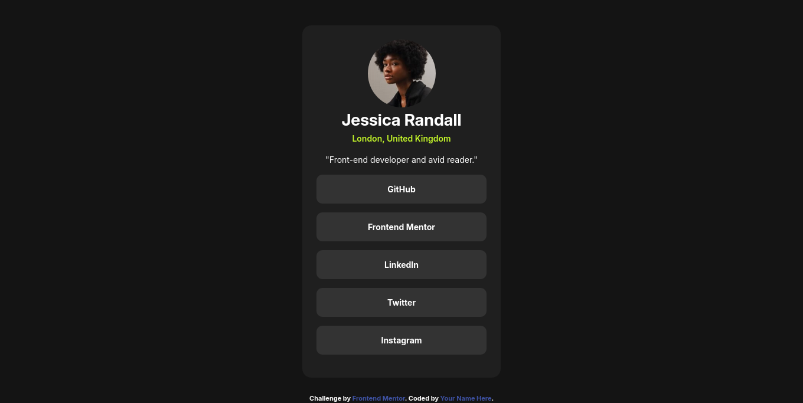

# Frontend Mentor - Social links profile solution

This is a solution to the [Social links profile challenge on Frontend Mentor](https://www.frontendmentor.io/challenges/social-links-profile-UG32l9m6dQ). Frontend Mentor challenges help you improve your coding skills by building realistic projects. 

## Table of contents

- [Overview](#overview)
  - [The challenge](#the-challenge)
  - [Screenshot](#screenshot)
  - [Links](#links)
- [My process](#my-process)
  - [Built with](#built-with)
  - [What I learned](#what-i-learned)
  - [Continued development](#continued-development)
- [Author](#author)

## Overview

### The challenge

Users should be able to:

- See hover and focus states for all interactive elements on the page

### Screenshot

### Links

- Solution URL: [https://github.com/Elvys-c](https://github.com/Elvys-c)
- Live Site URL: [https://elvys-c.github.io/social-links-profile/](https://elvys-c.github.io/social-links-profile/)

## My process

my process has starting defining the defaults sections header, main and footer. i starting styling header, when header look visuality like the exemple i moving for styling main, when main look visuality like exemple and finally styling footer.

### Built with

- Semantic HTML5 markup
- CSS custom properties
- Flexbox
- Mobile-first workflow

### What I learned

I always had difficulty to use flexbox. this challenge help do praticity position of HTML elements with flexbox.

### Continued development

I want to improve my ability positionnement of HTML elements.

## Author

- Frontend Mentor - [@Elvys-c](https://www.frontendmentor.io/profile/Elvys-c)
